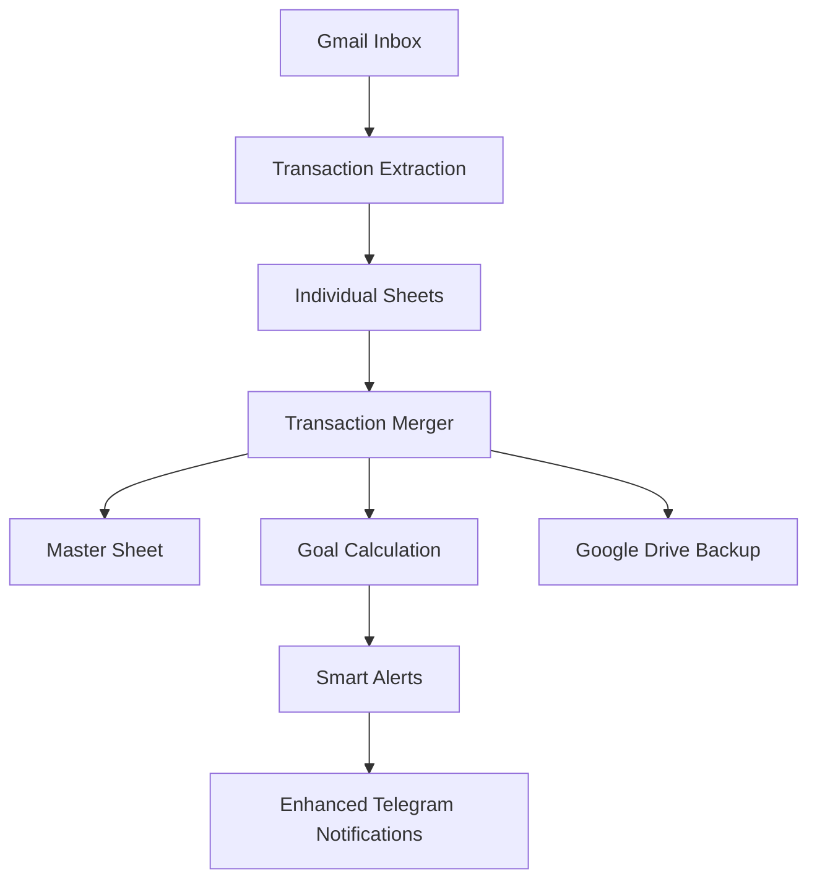

# Spend Analysis Optimizer

A comprehensive personal finance tracking system that automatically extracts transaction data from Gmail and provides intelligent spending analysis with budget tracking and Telegram notifications.

## 🚀 Features

- **Automated Transaction Extraction**: Parses bank transaction emails from Gmail
- **Multi-Bank Support**: ICICI, HDFC, SBI, and American Express
- **Dual-User System**: Separate processing for multiple family members
- **Smart Categorization**: Automatic transaction categorization with merchant detection
- **Smart Goal Tracking**: 6-month baseline with progressive reduction targets
- **Budget Alerts**: 75% threshold warnings with contextual messaging
- **Telegram Notifications**: Enhanced summaries with goal progress and insights
- **Google Drive Backup**: Automated data backup and recovery
- **Performance Optimized**: Bank-wise extraction to avoid timeout issues
- **Anomaly Detection**: Unusual spending pattern alerts
- **Weekly Analysis**: Performance scoring and actionable insights

## 📁 System Architecture

```
Spend_Analysis_Optimizer/
├── Transactions-Surya.js      # Primary user transaction extractor
├── Transactions-Namita.js     # Secondary user transaction extractor  
├── Transaction-Merger.js      # Data consolidation and notifications
├── config.template.js         # Configuration template
├── REFACTORING_GUIDE.md      # Technical implementation details
└── CHANGELOG.md              # Version history
```

## 🔧 Setup Instructions

### 1. Configuration Setup
```bash
# Copy template and configure
cp config.template.js config.js
```

Edit `config.js` with your credentials:
- Google Sheets URLs (individual and master sheets)
- Telegram Bot Token and Chat ID
- Gmail account details

### 2. Google Apps Script Deployment
1. Create new Google Apps Script projects for each user
2. Deploy `Transactions-Surya.js` in primary Gmail account
3. Deploy `Transactions-Namita.js` in secondary Gmail account  
4. Deploy `Transaction-Merger.js` in either account

### 3. Google Sheets Setup
Create sheets with these columns:
```
Date | Amount | Info | Category | Bank | Person | Card Last 4 | Merchant | Sub-Category | Notes
```

### 4. Telegram Bot Setup
1. Create bot via @BotFather
2. Get bot token and chat ID
3. Configure in `config.js`

## 🏦 Supported Banks

### ICICI Bank
- **Format**: Debit/Credit card transactions
- **Parsing**: Amount, merchant, card details
- **Thread Limit**: 50 (performance optimization)

### HDFC Bank  
- **Format**: Account debits and credit card transactions
- **Parsing**: Amount, merchant, transaction type
- **Thread Limit**: 50 (performance optimization)

### State Bank of India (SBI)
- **Format**: Account transaction alerts
- **Parsing**: Amount, transaction details
- **User**: Namita only

### American Express
- **Format**: Dual format support (pre/post April 2025)
- **Parsing**: Amount, merchant, card details
- **Thread Limit**: Unlimited (complete transaction capture)
- **Cutoff Dates**: 
  - Surya: April 1, 2025
  - Namita: April 22, 2025

## ⚡ Performance Features

### Bank-wise Extraction
```javascript
// Separate functions prevent timeouts
extractICICIOnly()    // ICICI transactions only
extractHDFCOnly()     // HDFC transactions only  
extractAmexOnly()     // Amex transactions only
extractBankTransactions() // All banks (24-hour mode)
```

### Thread Optimization
- **ICICI/HDFC**: Limited to 50 threads for speed
- **Amex**: Unlimited threads for complete capture
- **24-Hour Mode**: Processes last 24 hours only

### Timeout Prevention
- Individual bank functions stay within 6-minute Google Apps Script limits
- Incremental processing avoids re-processing existing data
- Memory-efficient message handling

## 🎯 Smart Goal Tracking System

### Progressive Reduction Goals
- **6-Month Baseline**: Calculates average spending from last 6 months
- **Phase 1 (Months 1-3)**: 10% reduction target
- **Phase 2 (Months 4-6)**: 20% reduction target  
- **Phase 3 (Months 7-9)**: 30% reduction target

### Smart Alert System
- **Budget Warnings**: 75% threshold alerts with remaining amount
- **Critical Alerts**: Budget exceeded notifications
- **Anomaly Detection**: Unusual spending pattern identification
- **Positive Reinforcement**: Savings achievement celebrations
- **Contextual Messages**: Motivational, educational, and actionable advice

### Goal Progress Tracking
```javascript
// Visual progress indicators
🟢 On Track: < 75% of budget used
🟡 Warning: 75-100% of budget used
🔴 Critical: > 100% of budget used
📊 Anomaly: Spending faster than expected
```

## 📱 Enhanced Telegram Notifications

### Daily Summaries (Enhanced)
- **Today's Spending**: Person and bank-wise breakdown
- **Month-to-Date**: Running monthly totals
- **Goal Progress**: Visual progress bars with emojis
- **Smart Alerts**: Top 3 most important budget alerts
- **Contextual Messages**: Personalized motivational advice
- **Total Savings**: Monthly savings compared to baseline

### Weekly Analysis Reports
- **Weekly Spending**: Person and category breakdowns
- **Goal Performance**: Monthly goal status overview
- **Overall Score**: Percentage of goals on track
- **Weekly Insights**: AI-driven spending recommendations
- **Top Categories**: Highest spending areas identification
- **Performance Trends**: Spending velocity analysis

### Smart Contextual Messaging
- **Motivational**: "Excellent! You've saved ₹2,500 this month!"
- **Educational**: "All categories are on track! Keep up the great work!"
- **Actionable**: "Focus on reducing spending in 2 categories to get back on track"
- **Seasonal**: "Festival season - plan your spending to stay within goals!"

## 🚀 Smart Goal Tracking Usage

### Enhanced Daily Summary
```javascript
sendDailySummaryTelegram();
// Now includes:
// - 6-month baseline calculation
// - Progressive reduction goals (10% → 20% → 30%)
// - Smart budget alerts with contextual messaging
// - Goal progress visualization with emojis
// - Total savings tracking
```

### Weekly Analysis Report
```javascript
sendWeeklySummaryTelegram();
// Comprehensive analysis with:
// - Weekly spending breakdown by person/category
// - Goal performance scoring
// - AI-driven insights and recommendations
// - Performance trend analysis
// - Optimization opportunities
```

### Goal Management Functions
```javascript
// Calculate current goals based on 6-month baseline
var goals = calculateGoalTargets(masterSheet);

// Get current spending by category
var spending = getCurrentMonthSpending(masterSheet);

// Generate smart alerts and contextual messages
var alerts = generateSmartAlerts(goals, spending);
```

## 🔄 Enhanced Data Flow



## 🛠️ Technical Details

### Execution Schedule
- **Individual Extractors**: Run every 4-6 hours
- **Merger Script**: Run every 2 hours
- **24-Hour Processing**: Daily incremental updates

### Error Handling
- Gmail API timeout recovery
- Telegram API validation
- Google Drive backup verification
- Duplicate transaction prevention

### Data Schema
```javascript
{
    date: "DD/MM/YYYY",
    amount: 1234.56,
    info: "Transaction description", 
    category: "Food",
    bank: "ICICI",
    person: "Surya",
    cardLast4: "1234",
    merchant: "Merchant name",
    subCategory: "Restaurants",
    notes: "Additional info"
}
```

## 🔐 Security Features

- Sensitive credentials in separate config file
- Config template for public repository
- `.gitignore` prevents credential exposure
- Telegram token validation

## 📊 Advanced Analytics & Insights

### Smart Goal Analytics
- **6-Month Baseline Calculation**: Historical spending averages
- **Progressive Target Setting**: Phased reduction goals
- **Real-time Progress Tracking**: Daily goal monitoring
- **Performance Scoring**: Overall achievement percentage
- **Savings Calculation**: Baseline vs actual comparison

### Spending Pattern Analysis
- **Anomaly Detection**: Unusual spending identification
- **Velocity Tracking**: Spending rate vs expected pace
- **Category Performance**: Goal achievement by category
- **Monthly Projections**: End-of-month spending forecasts
- **Trend Analysis**: Week-over-week comparisons

### Contextual Intelligence
- **Seasonal Adjustments**: Festival and holiday considerations
- **Behavioral Insights**: Spending trigger identification
- **Optimization Opportunities**: Category-specific recommendations
- **Achievement Recognition**: Milestone celebrations

## 🚨 Troubleshooting

### Common Issues
1. **Timeout Errors**: Use bank-specific extraction functions
2. **Missing Transactions**: Check Amex thread limits
3. **Telegram Failures**: Validate bot token and chat ID
4. **Duplicate Data**: Ensure proper date filtering

### Performance Optimization
- Use 24-hour mode for daily updates
- Run bank-specific functions for targeted extraction
- Monitor Google Apps Script execution time
- Optimize thread limits based on data volume

## 📈 Version History

- **v2.1.0**: Smart goal tracking and alert system with progressive reduction targets
- **v2.0.1**: Dashboard removal, documentation update
- **v2.0.0**: Major refactoring with performance optimization
- **v1.0.0**: Initial Gmail extraction system

## 🤝 Contributing

1. Fork the repository
2. Create feature branch
3. Update documentation
4. Test with sample data
5. Submit pull request

## 📄 License

Personal use project - modify as needed for your requirements.

## 🎯 Expected Outcomes & Benefits

### Smart Goal System Achievements
- **Realistic Targets**: Goals based on actual 6-month spending history
- **Gradual Reduction**: Sustainable 10-30% reduction over 9 months
- **Behavioral Change**: Positive reinforcement through contextual guidance
- **Automated Monitoring**: Daily progress tracking without manual intervention
- **Intelligent Alerts**: Context-aware notifications with actionable advice

### Projected Savings Timeline
- **Month 1-3 (Phase 1)**: 10-15% expense reduction in top categories
- **Month 4-6 (Phase 2)**: 20-25% overall expense reduction
- **Month 7-9 (Phase 3)**: 30% reduction with sustainable spending habits
- **Savings Potential**: ₹15,000-25,000 monthly savings for average users

### Smart Features Impact
- **75% Threshold Alerts**: Prevent budget overruns before they happen
- **Anomaly Detection**: Catch unusual spending patterns early
- **Weekly Insights**: Data-driven recommendations for optimization
- **Contextual Messaging**: Motivational support for goal achievement
- **Performance Scoring**: Gamified approach to expense management

## 🆘 Support

For issues or questions:
1. Check `REFACTORING_GUIDE.md` for technical details
2. Review `CHANGELOG.md` for recent changes
3. Validate configuration in `config.template.js`